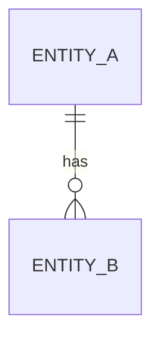

# feature-plan

Generate a complete feature planning document set for full-stack development.

## Usage

```
/feature-plan <feature-name> <feature-description> [--targets=<target1>,<target2>]
```

**Examples:**
```
/feature-plan user 用户体系，包含登录、注册、修改密码
/feature-plan user 用户体系 --targets=backend,native_app
/feature-plan order 订单模块 --targets=backend
```

**Parameters:**
- `feature-name`: A short English identifier (e.g., `user`, `order`, `payment`)
- `feature-description`: The feature requirements in natural language
- `--targets` (optional): Comma-separated list of target sub-projects. If omitted, a multi-select prompt will be shown.

If a design mockup image is provided, it will be used as reference for the UI document.

## Instructions

You are a full-stack development planner. When invoked, follow these steps:

### Step 1: Parse Input

Extract from user input:
- **feature-name**: A short English identifier (e.g., `user`, `order`, `payment`)
- **feature-description**: The feature requirements in natural language
- **--targets** (optional): Comma-separated target sub-project names
- **design-mockup** (optional): An attached image file

### Step 1.5: Determine Target Sub-Projects

If `--targets` is provided, use those directly. Otherwise, **auto-discover** available sub-projects by scanning the project root:

| Detection | Sub-Project | Tech Stack |
|-----------|-------------|------------|
| `backend/build.gradle` exists | `backend` | Spring Boot + MyBatis-Plus |
| `native_app/pubspec.yaml` exists | `native_app` | Flutter + Riverpod + Freezed |

Present a multi-select prompt to the user:
```
请选择需要生成代码的目标工程：
[1] backend (Spring Boot)
[2] native_app (Flutter)
可多选，如: 1,2
```

Record the selected targets. This determines:
- Which document sections to generate in `task.md`
- Whether `ui.md` is generated (only for frontend targets)
- Which sub-project rules to reference

Store the targets list in `docs/{feature-name}/task.md` header for `/feature-execute` to read.

### Step 2: Understand Existing Project Context

Before generating documents, read the existing project structure to ensure consistency:

**Backend (Spring Boot + MyBatis-Plus):**
- Read `backend/src/main/java/com/shadow/backend/` to understand existing module patterns
- Key patterns to follow:
  - Module structure: `controller/service/dto/entity/mapper/vo/response`
  - Entity uses MyBatis-Plus annotations (`@TableName`, `@TableId`, `@TableLogic`, `@TableField`)
  - All API responses wrapped in `Result<T>` (code, msg, data), pagination uses `PageResult<T>`
  - Business exceptions use `BusinessException` with `IResultCode` enum
  - Controller uses `@RestController`, `@RequestMapping("/api/xxx")`, `@RequiredArgsConstructor`
  - Service layer: interface + impl pattern
  - DTO for input, VO for output

**Frontend (Flutter + Riverpod + Freezed):**
- Read `native_app/lib/` to understand existing patterns
- Key patterns to follow:
  - Feature-first structure: `lib/features/{feature_name}/` with subdirs: `models/`, `datasources/`, `repositories/`, `view_model/`, `view/`
  - Models use Freezed + JsonSerializable (immutable, code-generated)
  - Repository: abstract interface + impl class, Provider returns interface type
  - ViewModel: Notifier/AsyncNotifier via Riverpod
  - View: uses `ref.watch()` and `ref.listen()`, never directly accesses Repository
  - Router: GoRouter in `lib/core/router/app_router.dart`
  - Network: Dio-based `DioClient` in `lib/core/network/`

### Step 3: Generate Documents

Create the directory `docs/{feature-name}/` and generate documents based on selected targets:

**Always generated (target-independent):**
- `requirement.md` — 需求文档
- `api.md` — 接口约束文档
- `domain.md` — 数据模型文档

**Conditionally generated (based on targets):**
- `ui.md` — only if a frontend target (e.g., `native_app`) is selected
- `task.md` — always generated, but sections depend on targets

---

#### 3.1 `docs/{feature-name}/requirement.md`

```markdown
# {Feature Name} - 需求文档

## 功能概述
Brief description of the feature and its business value.

## 用户故事
- As a [role], I want to [action], so that [benefit].
- ...

## 功能列表
| 优先级 | 功能 | 描述 |
|--------|------|------|
| P0     | xxx  | xxx  |
| P1     | xxx  | xxx  |

## 非功能性需求
- 安全: ...
- 性能: ...
- 兼容性: ...

## 边界条件与异常场景
| 场景 | 触发条件 | 预期行为 |
|------|----------|----------|
| xxx  | xxx      | xxx      |
```

---

#### 3.2 `docs/{feature-name}/api.md`

```markdown
# {Feature Name} - 接口约束文档

## 接口总览
| 方法 | 路径 | 描述 | 认证 |
|------|------|------|------|
| POST | /api/xxx | xxx | 否 |

## 接口详情

### 1. [接口名称]
- **方法**: `POST`
- **路径**: `/api/xxx`
- **认证**: 否/是

**请求参数:**

| 参数名 | 位置 | 类型 | 必填 | 说明 |
|--------|------|------|------|------|
| xxx    | Body | String | 是 | xxx |

**请求体示例:**
```json
{
  "field": "value"
}
```

**成功响应:**
```json
{
  "code": 200,
  "msg": "success",
  "data": { ... }
}
```

**失败响应:**
```json
{
  "code": xxx,
  "msg": "错误描述",
  "data": null
}
```

**错误码:**
| 错误码 | 描述 |
|--------|------|
| xxx    | xxx  |
```

**IMPORTANT**: All responses MUST use `Result<T>` wrapper format: `{ code, msg, data }`. Pagination APIs use `PageResult<T>`.

---

#### 3.3 `docs/{feature-name}/domain.md`

```markdown
# {Feature Name} - 数据模型文档

## 实体定义

### {EntityName}
| 字段 | 类型 | 约束 | 说明 |
|------|------|------|------|
| id   | Long | PK, AUTO_INCREMENT | 主键 |
| xxx  | String | NOT NULL | xxx |

## 实体关系


## 数据库表结构
```sql
CREATE TABLE `table_name` (
  `id` bigint NOT NULL AUTO_INCREMENT,
  `xxx` varchar(64) NOT NULL COMMENT 'xxx',
  `deleted` tinyint NOT NULL DEFAULT 0,
  `create_time` datetime NOT NULL DEFAULT CURRENT_TIMESTAMP,
  `update_time` datetime NOT NULL DEFAULT CURRENT_TIMESTAMP ON UPDATE CURRENT_TIMESTAMP,
  PRIMARY KEY (`id`)
) ENGINE=InnoDB DEFAULT CHARSET=utf8mb4;
```

## 枚举定义
| 枚举名 | 值 | 描述 |
|--------|-----|------|
| xxx    | 0   | xxx  |
```

**IMPORTANT**: Align with backend conventions:
- Use MyBatis-Plus annotations: `@TableName`, `@TableId(type = IdType.AUTO)`, `@TableLogic`, `@TableField(fill = FieldFill.INSERT)`
- Include `deleted`, `createTime`, `updateTime` fields by default
- Table names use `sys_` or business prefix

---

#### 3.4 `docs/{feature-name}/ui.md`

```markdown
# {Feature Name} - UI 文档

## 页面列表
| 页面 | 路由 | 描述 |
|------|------|------|
| XxxPage | /xxx | xxx |

## 页面详情

### 1. [页面名称]
- **路由**: `/xxx`
- **类型**: 全屏页面 / 弹窗 / 底部弹窗

**布局结构:**
```
Scaffold
├── AppBar(title: 'xxx')
├── Body
│   ├── Widget1
│   ├── Widget2
│   └── Widget3
└── BottomBar (optional)
```

**交互逻辑:**
- 表单验证: ...
- 加载状态: 显示 Loading indicator
- 错误提示: 使用 SnackBar 展示错误信息
- 成功反馈: ...

**状态管理:**
- ViewModel: `XxxViewModel` (AsyncNotifier)
- 状态类型: `XxxState` (Freezed)
```

**IMPORTANT**:
- If a design mockup is provided, base the UI description on the mockup
- If no mockup, follow Material Design best practices
- Align with Flutter MVVM pattern: View only handles UI, delegates logic to ViewModel

---

#### 3.5 `docs/{feature-name}/task.md`

The task.md header MUST include the targets metadata:

```markdown
# {Feature Name} - 执行任务清单

<!-- targets: backend,native_app -->

## 目标工程
- [x] backend (Spring Boot)
- [x] native_app (Flutter)
```

**Only include sections for selected targets.** If only `backend` is selected, omit the frontend section entirely.

```markdown
# {Feature Name} - 执行任务清单

## 后端任务 (Spring Boot)

按以下顺序执行，每个任务完成后标记为 [x]:

- [ ] **Task B1: 创建 Entity**
  - 文件: `backend/src/main/java/com/shadow/backend/{module}/entity/{Entity}.java`
  - 依赖: 无
  - 参考: domain.md 中的实体定义

- [ ] **Task B2: 创建 Mapper**
  - 文件: `backend/src/main/java/com/shadow/backend/{module}/mapper/{Entity}Mapper.java`
  - 依赖: B1

- [ ] **Task B3: 创建 DTO/VO**
  - 文件: `backend/src/main/java/com/shadow/backend/{module}/dto/*.java`
  - 文件: `backend/src/main/java/com/shadow/backend/{module}/vo/*.java`
  - 依赖: 无

- [ ] **Task B4: 创建 ResultCode 枚举**
  - 文件: `backend/src/main/java/com/shadow/backend/{module}/response/{Module}ResultCode.java`
  - 依赖: 无

- [ ] **Task B5: 创建 Service 接口 + 实现**
  - 文件: `backend/src/main/java/com/shadow/backend/{module}/service/{Module}Service.java`
  - 文件: `backend/src/main/java/com/shadow/backend/{module}/service/impl/{Module}ServiceImpl.java`
  - 依赖: B1, B2, B3, B4

- [ ] **Task B6: 创建 Controller**
  - 文件: `backend/src/main/java/com/shadow/backend/{module}/controller/{Module}Controller.java`
  - 依赖: B5

- [ ] **Task B7: 更新数据库 Schema**
  - 文件: `backend/src/main/resources/sql/schema.sql`
  - 依赖: B1

- [ ] **Task B8: 编写 Service 单元测试（必须，核心逻辑）**
  - 文件: `backend/src/test/java/com/shadow/backend/{module}/service/impl/{Module}ServiceImplTest.java`
  - 依赖: B5
  - 范围: 见 `backend/.qoder/rules/testing-convention.md`；JUnit5 + Mockito，不启动 Spring 上下文，覆盖成功路径 + 每个业务分支/异常

- [ ] **Task B9: 权限/事务相关测试（强烈建议，视是否涉及）**
  - 依赖: B8
  - 仅当本功能涉及权限提供者分支或 `@Transactional` 业务规则时才需要，否则可跳过并说明原因

## 前端任务 (Flutter)

按以下顺序执行，每个任务完成后标记为 [x]:

- [ ] **Task F1: 创建 Model (Freezed)**
  - 文件: `native_app/lib/features/{feature}/models/{model}.dart`
  - 依赖: 无
  - 注意: 创建后必须执行 `flutter pub run build_runner build --delete-conflicting-outputs`

- [ ] **Task F2: 创建 DataSource**
  - 文件: `native_app/lib/features/{feature}/datasources/{feature}_datasource.dart`
  - 依赖: F1

- [ ] **Task F3: 创建 Repository 接口 + 实现**
  - 文件: `native_app/lib/features/{feature}/repositories/{feature}_repository.dart`
  - 依赖: F2

- [ ] **Task F4: 创建 ViewModel**
  - 文件: `native_app/lib/features/{feature}/view_model/{feature}_view_model.dart`
  - 依赖: F3

- [ ] **Task F5: 创建 View**
  - 文件: `native_app/lib/features/{feature}/view/{feature}_page.dart`
  - 依赖: F4

- [ ] **Task F6: 注册路由**
  - 文件: `native_app/lib/core/router/app_router.dart`
  - 依赖: F5

- [ ] **Task F7: 编写 ViewModel 状态测试（建议，不写 UI 测试）**
  - 文件: `native_app/test/features/{feature}/view_model/{feature}_view_model_test.dart`
  - 依赖: F4
  - 范围: 见 `native_app/.qoder/rules/testing-convention.md`；用 Fake Repository + `ProviderContainer`，不引入 mocktail/mockito，不测 View/路由
```

**IMPORTANT for task.md**:
- Every file path must be concrete and accurate (use actual module/feature names, not placeholders)
- Dependencies must be correct (a task cannot start before its dependencies are done)
- Backend and frontend tasks are independent tracks (can be parallelized)

### Step 4: Cross-Document Consistency Check

After generating all documents, verify:
1. Every API endpoint in `api.md` has corresponding request/response fields matching `domain.md` entities
2. Every entity in `domain.md` is referenced by at least one API in `api.md`
3. Every task in `task.md` maps to content defined in the other documents
4. If `ui.md` was generated, its pages correspond to APIs in `api.md`
5. Error codes in `api.md` are all defined in the ResultCode task
6. `task.md` header targets match the actually generated document sections

### Step 5: Notify User

After generating all documents, output a summary:
```
已生成功能规划文档：
- docs/{feature}/requirement.md - 需求文档
- docs/{feature}/api.md - 接口约束文档
- docs/{feature}/domain.md - 数据模型文档
- docs/{feature}/ui.md - UI 文档 (仅前端目标时生成)
- docs/{feature}/task.md - 执行任务清单

目标工程: {targets}

请审核以上文档，确认无误后执行 /feature-execute {feature} 开始开发。
```

## Constraints

- All documents must be written in Chinese (except code/technical identifiers)
- API paths must follow RESTful conventions
- Backend patterns must align with existing project conventions (MyBatis-Plus, Result wrapper, BusinessException)
- Frontend patterns must align with existing project conventions (Freezed, Riverpod, GoRouter)
- If the feature description is ambiguous, ask clarifying questions before generating
- Do NOT skip required documents (requirement.md, api.md, domain.md, task.md are always generated)
- `ui.md` is only generated when a frontend target is selected
- `task.md` sections must match the selected targets exactly
