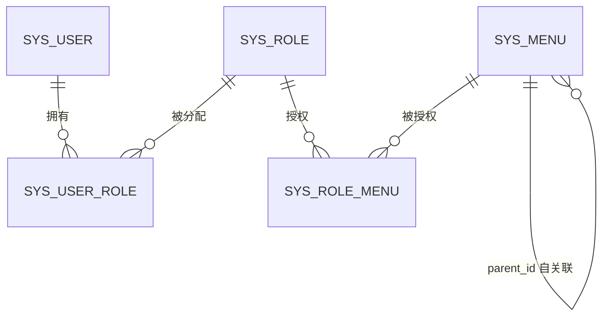

# Admin 工程优化 - 数据模型文档

## 变更结论

**本功能不新增实体、不修改表结构、不执行数据库迁移。** 仅涉及既有表的查询方式扩展与服务层校验规则，以下登记受影响表以便审查。

## 受影响实体

### sys_user（管理员账号，实体 `AdminUser`）

| 字段 | 类型 | 约束 | 说明 |
|------|------|------|------|
| id | BIGINT | PK, AUTO_INCREMENT | 主键 |
| username | VARCHAR(64) | NOT NULL, UNIQUE | 登录名 |
| password | VARCHAR(255) | NOT NULL | Argon2 哈希 |
| nickname | VARCHAR(64) | NULL | 昵称 |
| email | VARCHAR(128) | NULL | 邮箱 |
| status | TINYINT | NOT NULL DEFAULT 1 | 0=禁用 1=启用 |
| deleted / create_time / update_time | - | 常规 | 逻辑删除 + 自动填充 |

**变更**: 无结构变更；分页查询新增 `status` 精确过滤、经 `sys_user_role` 关联的 `roleId` 过滤（IN 查询）。

### sys_role（角色，实体 `SysRole`）

| 字段 | 类型 | 约束 | 说明 |
|------|------|------|------|
| id | BIGINT | PK, AUTO_INCREMENT | 主键 |
| name | VARCHAR(64) | NOT NULL | 角色名 |
| code | VARCHAR(64) | NOT NULL, UNIQUE | 角色编码 |
| sort_order | INT | NOT NULL DEFAULT 0 | 排序 |
| status | TINYINT | NOT NULL DEFAULT 1 | 0=禁用 1=启用 |
| remark | VARCHAR(255) | NULL | 备注 |
| deleted / create_time / update_time | - | 常规 | 逻辑删除 + 自动填充 |

**变更**: 无结构变更；分页查询新增 `status` 精确过滤。

### sys_menu（菜单，实体 `SysMenu`）

| 字段 | 类型 | 约束 | 说明 |
|------|------|------|------|
| id | BIGINT | PK, AUTO_INCREMENT | 主键 |
| parent_id | BIGINT | NOT NULL DEFAULT 0 | 父级 ID，0=根 |
| name | VARCHAR(64) | NOT NULL | 菜单名 |
| type | TINYINT | NOT NULL | 1=目录 2=菜单 3=按钮 |
| path | VARCHAR(255) | NULL | 前端路由路径 |
| icon | VARCHAR(64) | NULL | 图标名 |
| sort_order | INT | NOT NULL DEFAULT 0 | 排序 |
| permission | VARCHAR(128) | NULL | 权限标识（type=2/3） |
| visible | TINYINT | NOT NULL DEFAULT 1 | 0=隐藏 1=显示 |
| status | TINYINT | NOT NULL DEFAULT 1 | 0=禁用 1=启用 |
| deleted / create_time / update_time | - | 常规 | 逻辑删除 + 自动填充 |

**变更**: 无结构变更；create/update 新增父级合法性校验（存在性、类型、成环）。

### sys_user_role（管理员-角色关联，实体 `SysUserRole`）

| 字段 | 类型 | 约束 | 说明 |
|------|------|------|------|
| id | BIGINT | PK | 主键 |
| user_id | BIGINT | NOT NULL | 管理员 ID |
| role_id | BIGINT | NOT NULL | 角色 ID |

**变更**: 仅作为 `roleId` 过滤的查询来源（读）。

### sys_role_menu（角色-菜单关联，只读参考）

本次权限缓存失效逻辑调整不涉及该表结构。

## 实体关系

## 枚举定义

| 枚举 | 值 | 描述 |
|------|-----|------|
| 账号/角色状态 | 0 / 1 | 0=禁用，1=启用 |
| 菜单类型 | 1 / 2 / 3 | 1=目录，2=菜单，3=按钮 |
| 菜单可见性 | 0 / 1 | 0=隐藏，1=显示 |
| 菜单父级校验错误码 | 20103 / 20104 / 20105 | 父级不存在 / 自身或子级 / 按钮作父级 |

## 数据一致性约束

1. `sys_user_role.role_id` / `sys_role_menu.menu_id` 引用目标删除前，现有 Service 已有关联清理或占用校验，本次不改变其行为
2. 菜单父级成环由**服务层校验**保证（无外键/触发器），前端选项过滤仅作第一道防线，后端为最终防线
3. `schema.sql` 不需要任何修改；如执行阶段发现种子数据存在成环（当前无证据），暂停并向用户报告
