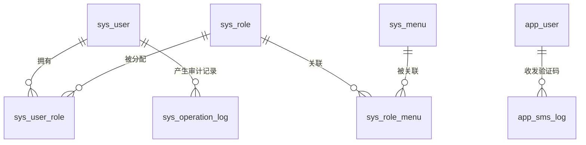

# backend-optimization - 数据模型文档

本次优化不改动既有业务表结构，新增 1 张审计日志表；主要变更集中在实体行为约束、Redis 键设计与枚举校验规则。

## 实体定义

### 变更：AuditStatusVO（响应视图收敛）

| 字段 | 类型 | 变更 | 说明 |
|------|------|------|------|
| auditStatus | Integer | 保留 | 审核状态：0-待审核，1-已通过，2-已拒绝 |
| phone | String | 保留 | 脱敏手机号（138****8000） |
| auditRemark | String | **移除** | 匿名接口不再返回 |
| nickname | String | **移除** | 匿名接口不再返回 |
| createTime | LocalDateTime | **移除** | 匿名接口不再返回 |

### 变更：SmsLog（不存明文验证码）

| 字段 | 类型 | 约束 | 说明 |
|------|------|------|------|
| code | String | NOT NULL | **行为变更**：不再保存验证码明文，统一写入固定掩码（如 `******`）；仅保留审计意义上的发送记录 |

> SmsLog 仍不作为校验依据（校验全部走 Redis），因此掩码不影响业务。

### 新增：OperationLog（sys_operation_log）

| 字段 | 类型 | 约束 | 说明 |
|------|------|------|------|
| id | Long | PK, AUTO_INCREMENT | 主键 |
| adminId | Long | NOT NULL | 操作管理员ID |
| username | String | VARCHAR(32) | 操作管理员用户名（冗余，便于审计检索） |
| method | String | VARCHAR(8), NOT NULL | HTTP 方法 |
| uri | String | VARCHAR(255), NOT NULL | 请求路径 |
| params | String | VARCHAR(1024) | 请求参数 JSON（脱敏：password/code 等字段掩码，超长截断） |
| resultCode | Integer | 业务结果码（成功 200 / 业务错误码） |
| ip | String | VARCHAR(64) | 客户端 IP（可信代理模式下取真实 IP） |
| costMs | Long | 耗时毫秒 |
| traceId | String | VARCHAR(32) | 链路追踪 ID |
| createTime | LocalDateTime | NOT NULL, 自动填充 | 操作时间 |

> 日志表不启用逻辑删除（`deleted` 字段不适用），仅追加。

## 数据库表结构

### 新增表：sys_operation_log

```sql
CREATE TABLE IF NOT EXISTS sys_operation_log (
    id          BIGINT       NOT NULL AUTO_INCREMENT COMMENT '主键',
    admin_id    BIGINT       NOT NULL COMMENT '操作管理员ID',
    username    VARCHAR(32)  DEFAULT NULL COMMENT '操作管理员用户名',
    method      VARCHAR(8)   NOT NULL COMMENT 'HTTP方法',
    uri         VARCHAR(255) NOT NULL COMMENT '请求路径',
    params      VARCHAR(1024) DEFAULT NULL COMMENT '请求参数JSON(脱敏)',
    result_code INT          DEFAULT NULL COMMENT '业务结果码',
    ip          VARCHAR(64)  DEFAULT NULL COMMENT '客户端IP',
    cost_ms     BIGINT       DEFAULT NULL COMMENT '耗时毫秒',
    trace_id    VARCHAR(32)  DEFAULT NULL COMMENT '链路追踪ID',
    create_time DATETIME     NOT NULL DEFAULT CURRENT_TIMESTAMP COMMENT '操作时间',
    PRIMARY KEY (id),
    INDEX idx_admin_id (admin_id),
    INDEX idx_create_time (create_time)
) ENGINE=InnoDB DEFAULT CHARSET=utf8mb4 COMMENT='管理端操作审计日志表';
```

同时以增量脚本 `backend/src/main/resources/sql/operation_log_migration.sql` 提供给已有环境执行（内容与上表一致）。

### 既有表行为约束（决策 D2）

| 表 | 约束 |
|----|------|
| app_user | `uk_phone`/`uk_username` 唯一键**永久占用**（含逻辑删除记录），不允许复用；插入冲突统一映射 409 |
| sys_user | `uk_username` 同上 |
| sys_role | `uk_code` 同上 |
| app_user.audit_status | 审核写入使用条件更新：`UPDATE ... SET audit_status=?, audit_remark=?, audit_time=? WHERE id=? AND audit_status=0`，影响行数为 0 视为已被审核 |
| app_user（重新提交） | 驳回信息置空必须显式 SET NULL（`audit_remark=NULL, audit_time=NULL`），不受 MyBatis-Plus 非空更新策略影响 |
| app_user / sys_user（资料更新） | 使用选择性字段更新（LambdaUpdateWrapper set 指定列），避免读-改-写覆盖并发变更 |

## 实体关系



## Redis 键设计

| 键 | 类型 | TTL | 用途 | 变更 |
|----|------|-----|------|------|
| `auth:refresh:{refreshToken}` | String(userId) | 7 天 | Refresh Token 凭证 | Lua 内校验并 GETDEL 旧键、注册新键（并发刷新仅一个成功）；创建 access 会话后复查映射未撤销 |
| `auth:refresh:user:{userId}` | Set(refreshToken) | 与 refresh 对齐 | **新增**：用户级撤销注册表；注册/轮换与集合维护同一 Lua 内完成；重置密码/禁用时 Lua 原子删除全部 refresh 键并清空集合 |
| `sms:code:{scene}:{phone}` | String(code) | 5 分钟 | 验证码本体 | 比较与删除改为 Lua 原子脚本 |
| `sms:limit:{phone}` | String | 60 秒 | 发送冷却 | 沿用 |
| `sms:attempt:{scene}:{phone}` | String(计数) | 与 code 对齐（5 分钟） | **新增**：验证码错误计数，达 5 次删除 code 键作废 |
| `sms:daily:{phone}` | String(计数) | 当日 24:00 | **新增**：每日发送计数，达 10 次拒绝发送 |
| `login:fail:{scene}:{identifier}` | String(计数) | 15 分钟 | 登录失败锁定 | 计数与过期设置改为原子（Lua 或带过期的 increment），避免无 TTL 残留 |
| `audit:query:limit:{phone}` | String | 60 秒 | **新增**：匿名审核状态查询频率限制 |

> Refresh Token 存储位置从 Sa-Token 账号级 Session 迁移至 **Token-Session**（`StpAppUtil.getTokenSession()`），实现设备级退出。

## 枚举定义

### AuditStatus（沿用，补充校验规则）

| 枚举名 | 值 | 描述 |
|--------|-----|------|
| PENDING | 0 | 待审核（注册默认态；管理员创建用户默认为已通过） |
| APPROVED | 1 | 已通过 |
| REJECTED | 2 | 已拒绝 |

**新增约束**: 审核接口入参 `auditStatus` 仅接受 1/2；`0` 及其他值返回参数错误。

### SmsScene（沿用）

LOGIN / REGISTER / RESET_PASSWORD，无变更。
