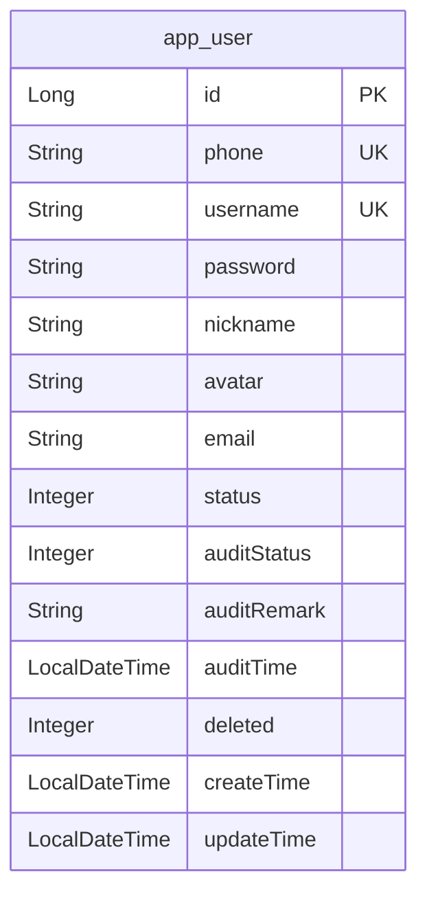

# 用户注册审核 - 数据模型文档

## 实体变更

### User（用户实体，修改现有）

> 对应文件: `backend/src/main/java/com/shadow/backend/user/entity/User.java`

| 字段 | 类型 | 约束 | 说明 | 变更 |
|------|------|------|------|------|
| id | Long | PK, AUTO_INCREMENT | 主键 | 保持 |
| phone | String(20) | NOT NULL, UNIQUE | 手机号（核心标识） | 保持 |
| username | String(32) | NULL, UNIQUE | 用户名 | 保持 |
| password | String(255) | NOT NULL | 密码（Argon2 加密） | 保持 |
| nickname | String(64) | NULL | 昵称 | 保持 |
| avatar | String(255) | NULL | 头像 URL | 保持 |
| email | String(128) | NULL | 邮箱 | 保持 |
| status | Integer | NOT NULL, DEFAULT 1 | 状态：0-禁用，1-启用 | 保持 |
| auditStatus | Integer | NOT NULL, DEFAULT 1 | 审核状态：0-待审核，1-已通过，2-已拒绝 | **新增** |
| auditRemark | String(255) | NULL | 审核备注/拒绝原因 | **新增** |
| auditTime | LocalDateTime | NULL | 审核时间 | **新增** |
| deleted | Integer | NOT NULL, DEFAULT 0 | 逻辑删除 | 保持 |
| createTime | LocalDateTime | NOT NULL, AUTO FILL | 创建时间 | 保持 |
| updateTime | LocalDateTime | NOT NULL, AUTO FILL | 更新时间 | 保持 |

> **变更说明：** 新增 `auditStatus`（NOT NULL, DEFAULT 1）、`auditRemark`（NULL）、`auditTime`（NULL）三个字段。现有用户默认 `auditStatus = 1`（已通过），新注册用户 `auditStatus = 0`（待审核）。

## VO 变更

### UserVO（修改现有）

> 对应文件: `backend/src/main/java/com/shadow/backend/user/vo/UserVO.java`

| 字段 | 类型 | 说明 | 变更 |
|------|------|------|------|
| id | Long | 主键 | 保持 |
| phone | String | 手机号 | 保持 |
| username | String | 用户名 | 保持 |
| nickname | String | 昵称 | 保持 |
| avatar | String | 头像 URL | 保持 |
| email | String | 邮箱 | 保持 |
| status | Integer | 状态 | 保持 |
| auditStatus | Integer | 审核状态：0-待审核，1-已通过，2-已拒绝 | **新增** |
| auditRemark | String | 审核备注/拒绝原因 | **新增** |
| auditTime | LocalDateTime | 审核时间 | **新增** |
| createTime | LocalDateTime | 创建时间 | 保持 |
| updateTime | LocalDateTime | 更新时间 | 保持 |

### AuditStatusResponse（新增 VO）

> 对应文件: `backend/src/main/java/com/shadow/backend/auth/vo/AuditStatusResponse.java`

| 字段 | 类型 | 说明 |
|------|------|------|
| auditStatus | Integer | 审核状态：0-待审核，1-已通过，2-已拒绝 |
| auditRemark | String | 审核备注/拒绝原因（拒绝时返回，其他状态为 null） |

> 用于 `GET /api/app/auth/audit-status` 接口响应，仅返回审核相关字段，不泄露用户隐私。

## DTO 变更

### RegisterResponse（新增 DTO）

> 对应文件: `backend/src/main/java/com/shadow/backend/auth/dto/RegisterResponse.java`

| 字段 | 类型 | 说明 |
|------|------|------|
| user | UserVO | 用户信息（含 auditStatus） |

> 替代原 `LoginResponse`，注册成功后不再返回 Token，仅返回用户信息。

### AuditUserRequest（新增 DTO）

> 对应文件: `backend/src/main/java/com/shadow/backend/admin/user/dto/AuditUserRequest.java`

| 字段 | 类型 | 约束 | 说明 |
|------|------|------|------|
| auditStatus | Integer | NOT NULL, 值为 1 或 2 | 审核结果：1-通过，2-拒绝 |
| auditRemark | String | 拒绝时必填，最长255位 | 审核备注/拒绝原因 |

### UserPageQuery（修改现有）

> 对应文件: `backend/src/main/java/com/shadow/backend/user/dto/UserPageQuery.java`

| 字段 | 类型 | 说明 | 变更 |
|------|------|------|------|
| page | Long | 页码 | 保持 |
| size | Long | 每页条数 | 保持 |
| username | String | 用户名模糊搜索 | 保持 |
| auditStatus | Integer | 审核状态筛选 | **新增** |

## 实体关系



> **说明：** 审核相关字段全部在 `app_user` 表内，不新增关联表。

## 数据库表结构变更

### app_user 表（ALTER）

```sql
-- 新增审核相关字段
ALTER TABLE app_user
    ADD COLUMN audit_status TINYINT NOT NULL DEFAULT 1 COMMENT '审核状态：0-待审核，1-已通过，2-已拒绝' AFTER status,
    ADD COLUMN audit_remark VARCHAR(255) DEFAULT NULL COMMENT '审核备注/拒绝原因' AFTER audit_status,
    ADD COLUMN audit_time DATETIME DEFAULT NULL COMMENT '审核时间' AFTER audit_remark;

-- 为审核状态查询添加索引（管理员按待审核筛选）
ALTER TABLE app_user
    ADD INDEX idx_audit_status (audit_status);
```

> **注意：** `DEFAULT 1` 确保现有用户自动设为「已通过」状态。新注册用户由代码设为 `0`（待审核）。

**完整建表语句（新环境使用，含审核字段）：**
```sql
CREATE TABLE IF NOT EXISTS app_user (
    id           BIGINT       NOT NULL AUTO_INCREMENT COMMENT '主键',
    phone        VARCHAR(20)  NOT NULL COMMENT '手机号',
    username     VARCHAR(32)  DEFAULT NULL COMMENT '用户名',
    password     VARCHAR(255) NOT NULL COMMENT '密码（Argon2）',
    nickname     VARCHAR(64)  DEFAULT NULL COMMENT '昵称',
    avatar       VARCHAR(255) DEFAULT NULL COMMENT '头像URL',
    email        VARCHAR(128) DEFAULT NULL COMMENT '邮箱',
    status       TINYINT      NOT NULL DEFAULT 1 COMMENT '状态：0-禁用，1-启用',
    audit_status TINYINT      NOT NULL DEFAULT 1 COMMENT '审核状态：0-待审核，1-已通过，2-已拒绝',
    audit_remark VARCHAR(255) DEFAULT NULL COMMENT '审核备注/拒绝原因',
    audit_time   DATETIME     DEFAULT NULL COMMENT '审核时间',
    deleted      TINYINT      NOT NULL DEFAULT 0 COMMENT '逻辑删除：0-未删除，1-已删除',
    create_time  DATETIME     NOT NULL DEFAULT CURRENT_TIMESTAMP COMMENT '创建时间',
    update_time  DATETIME     NOT NULL DEFAULT CURRENT_TIMESTAMP ON UPDATE CURRENT_TIMESTAMP COMMENT '更新时间',
    PRIMARY KEY (id),
    UNIQUE KEY uk_phone (phone),
    UNIQUE KEY uk_username (username),
    INDEX idx_audit_status (audit_status)
) ENGINE=InnoDB DEFAULT CHARSET=utf8mb4 COMMENT='用户表';
```

## 枚举定义

### AuditStatus（审核状态，新增）

> 对应文件: `backend/src/main/java/com/shadow/backend/user/constant/AuditStatus.java`

| 枚举值 | 值 | 描述 |
|--------|-----|------|
| PENDING | 0 | 待审核 |
| APPROVED | 1 | 已通过 |
| REJECTED | 2 | 已拒绝 |

### AuthResultCode（修改现有，新增 10017、10018）

> 对应文件: `backend/src/main/java/com/shadow/backend/auth/response/AuthResultCode.java`

| 枚举值 | 值 | 描述 | 变更 |
|--------|-----|------|------|
| PHONE_NOT_REGISTERED | 10010 | 手机号未注册 | 保持 |
| PHONE_ALREADY_REGISTERED | 10011 | 手机号已注册 | 保持 |
| SMS_CODE_NOT_FOUND | 10012 | 验证码已过期，请重新获取 | 保持 |
| SMS_CODE_INVALID | 10013 | 验证码错误 | 保持 |
| SMS_CODE_SEND_TOO_FREQUENT | 10014 | 验证码发送过于频繁，请稍后再试 | 保持 |
| SMS_SCENE_INVALID | 10015 | 无效的验证码场景 | 保持 |
| REFRESH_TOKEN_INVALID | 10016 | 刷新令牌无效或已过期 | 保持 |
| USER_AUDIT_PENDING | 10017 | 账号审核中，请耐心等待管理员审核 | **新增** |
| USER_AUDIT_REJECTED | 10018 | 注册审核未通过 | **新增** |

### UserResultCode（修改现有，新增 10019）

> 对应文件: `backend/src/main/java/com/shadow/backend/user/response/UserResultCode.java`

| 枚举值 | 值 | 描述 | 变更 |
|--------|-----|------|------|
| USERNAME_EXIST | 10001 | 用户名已存在 | 保持 |
| USER_NOT_FOUND | 10002 | 用户不存在 | 保持 |
| USER_DISABLED | 10003 | 账号已被禁用 | 保持 |
| LOGIN_FAILED | 10004 | 手机号或密码错误 | 保持 |
| OLD_PASSWORD_INCORRECT | 10005 | 原密码不正确 | 保持 |
| USER_ALREADY_AUDITED | 10019 | 该用户已审核，无需重复操作 | **新增** |

## Sa-Token 配置变更

> 对应文件: `backend/src/main/java/com/shadow/backend/common/config/SaTokenConfigure.java`

**免登录白名单更新（excludePathPatterns 新增）：**

| 新增路径 | 说明 |
|----------|------|
| `/api/app/auth/audit-status` | 审核状态查询（免登录） |

## 业务逻辑变更说明

### 注册流程变更

```
旧流程: 验证验证码 → 检查手机号 → 创建用户(status=1) → 生成双Token → 返回 LoginResponse
新流程: 验证验证码 → 检查手机号 → 创建用户(status=1, auditStatus=0) → 返回 RegisterResponse（无Token）
```

**被拒绝用户重新注册逻辑：**
```
验证验证码 → 查手机号 → 手机号存在？
  ├─ 不存在 → 创建新用户(auditStatus=0) → 返回 RegisterResponse
  ├─ 存在且 auditStatus=2 → 覆盖更新用户(新密码, auditStatus=0, auditRemark=null, auditTime=null) → 返回 RegisterResponse
  └─ 存在且 auditStatus=0或1 → 抛出 PHONE_ALREADY_REGISTERED 异常
```

### 登录流程变更

```
旧流程: 验证密码/验证码 → 检查status → 生成双Token → 返回 LoginResponse
新流程: 验证密码/验证码 → 检查auditStatus → 检查status → 生成双Token → 返回 LoginResponse
         │
         ├─ auditStatus=0(待审核) → 抛出 USER_AUDIT_PENDING(10017)
         ├─ auditStatus=2(已拒绝) → 抛出 USER_AUDIT_REJECTED(10018, 含auditRemark)
         └─ auditStatus=1(已通过) → 继续检查status → 正常登录
```

### 审核操作逻辑

```
管理员发起审核 → 查用户 → 用户存在？
  ├─ 不存在 → 抛出 USER_NOT_FOUND(10002)
  └─ 存在 → auditStatus=0(待审核)？
      ├─ 是 → 更新 auditStatus、auditRemark、auditTime → 返回 UserVO
      └─ 否 → 抛出 USER_ALREADY_AUDITED(10019)
```
