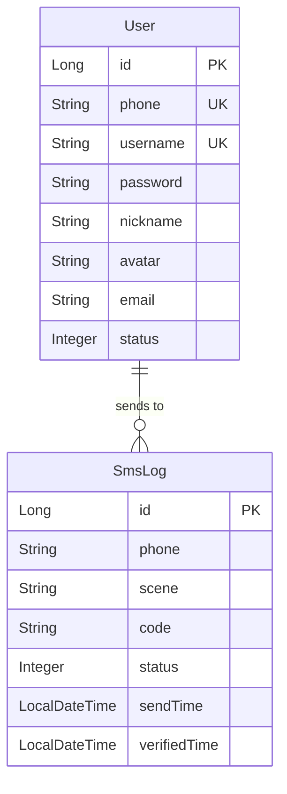

# 用户体系 - 数据模型文档

## 实体定义

### User（用户实体，修改现有）

> 对应文件: `backend/src/main/java/com/shadow/backend/user/entity/User.java`

| 字段 | 类型 | 约束 | 说明 |
|------|------|------|------|
| id | Long | PK, AUTO_INCREMENT | 主键 |
| phone | String(20) | NOT NULL, UNIQUE | 手机号（核心标识） |
| username | String(32) | NULL, UNIQUE | 用户名（自动生成，可修改） |
| password | String(255) | NOT NULL | 密码（Argon2 加密） |
| nickname | String(64) | NULL | 昵称 |
| avatar | String(255) | NULL | 头像 URL |
| email | String(128) | NULL | 邮箱 |
| status | Integer | NOT NULL, DEFAULT 1 | 状态：0-禁用，1-启用 |
| deleted | Integer | NOT NULL, DEFAULT 0 | 逻辑删除：0-未删除，1-已删除 |
| createTime | LocalDateTime | NOT NULL, AUTO FILL | 创建时间 |
| updateTime | LocalDateTime | NOT NULL, AUTO FILL | 更新时间 |

> **变更说明：** 新增 `phone`（NOT NULL, UNIQUE）、`avatar` 字段；`username` 由 NOT NULL 改为 NULL（允许为空，注册时自动生成）。

### SmsLog（短信验证码日志，新增）

> 对应文件: `backend/src/main/java/com/shadow/backend/auth/entity/SmsLog.java`

| 字段 | 类型 | 约束 | 说明 |
|------|------|------|------|
| id | Long | PK, AUTO_INCREMENT | 主键 |
| phone | String(20) | NOT NULL | 手机号 |
| scene | String(32) | NOT NULL | 场景：LOGIN / REGISTER / RESET_PASSWORD |
| code | String(6) | NOT NULL | 验证码 |
| status | Integer | NOT NULL, DEFAULT 0 | 状态：0-已发送，1-已验证，2-已过期 |
| sendTime | LocalDateTime | NOT NULL, AUTO FILL | 发送时间 |
| verifiedTime | LocalDateTime | NULL | 验证时间 |
| deleted | Integer | NOT NULL, DEFAULT 0 | 逻辑删除 |
| createTime | LocalDateTime | NOT NULL, AUTO FILL | 创建时间 |
| updateTime | LocalDateTime | NOT NULL, AUTO FILL | 更新时间 |

## 实体关系



> **说明：** User 与 SmsLog 通过 `phone` 字段关联（非外键，因 SmsLog 记录可能包含未注册手机号）。验证码的实际校验使用 Redis（TTL 5 分钟），SmsLog 仅作审计记录。

## Redis 数据结构

### 短信验证码

| Key | 值 | TTL | 说明 |
|-----|-----|-----|------|
| `sms:code:{scene}:{phone}` | 6位数字验证码 | 5分钟 | 验证码存储，验证后立即删除 |
| `sms:limit:{phone}` | "1" | 60秒 | 发送频率限制，防止刷量 |

**示例：**
```
sms:code:LOGIN:13800138000  →  "123456"  (TTL 300s)
sms:limit:13800138000       →  "1"      (TTL 60s)
```

### Refresh Token

| Key | 值 | TTL | 说明 |
|-----|-----|-----|------|
| `auth:refresh:{refreshToken}` | userId (Long) | 7天 | Refresh Token → 用户ID 映射 |

**示例：**
```
auth:refresh:r1s2t3u4-v5w6-7890-abcd-ef1234567890  →  "1"  (TTL 604800s)
```

> **Token 轮转机制：** 每次刷新时，删除旧 Refresh Token，生成新 Refresh Token 并存入 Redis，实现一次性使用。

## 数据库表结构

### app_user（修改现有表）

```sql
-- 新增字段
ALTER TABLE app_user
    ADD COLUMN phone VARCHAR(20) NOT NULL COMMENT '手机号' AFTER username,
    ADD COLUMN avatar VARCHAR(255) DEFAULT NULL COMMENT '头像URL' AFTER nickname,
    ADD UNIQUE KEY uk_phone (phone);

-- 修改 username 为可空
ALTER TABLE app_user
    MODIFY COLUMN username VARCHAR(32) DEFAULT NULL COMMENT '用户名';
```

**完整建表语句（新环境使用）：**
```sql
CREATE TABLE IF NOT EXISTS app_user (
    id          BIGINT       NOT NULL AUTO_INCREMENT COMMENT '主键',
    phone       VARCHAR(20)  NOT NULL COMMENT '手机号',
    username    VARCHAR(32)  DEFAULT NULL COMMENT '用户名',
    password    VARCHAR(255) NOT NULL COMMENT '密码（Argon2）',
    nickname    VARCHAR(64)  DEFAULT NULL COMMENT '昵称',
    avatar      VARCHAR(255) DEFAULT NULL COMMENT '头像URL',
    email       VARCHAR(128) DEFAULT NULL COMMENT '邮箱',
    status      TINYINT      NOT NULL DEFAULT 1 COMMENT '状态：0-禁用，1-启用',
    deleted     TINYINT      NOT NULL DEFAULT 0 COMMENT '逻辑删除：0-未删除，1-已删除',
    create_time DATETIME     NOT NULL DEFAULT CURRENT_TIMESTAMP COMMENT '创建时间',
    update_time DATETIME     NOT NULL DEFAULT CURRENT_TIMESTAMP ON UPDATE CURRENT_TIMESTAMP COMMENT '更新时间',
    PRIMARY KEY (id),
    UNIQUE KEY uk_phone (phone),
    UNIQUE KEY uk_username (username)
) ENGINE=InnoDB DEFAULT CHARSET=utf8mb4 COMMENT='用户表';
```

### app_sms_log（新增表）

```sql
CREATE TABLE IF NOT EXISTS app_sms_log (
    id            BIGINT       NOT NULL AUTO_INCREMENT COMMENT '主键',
    phone         VARCHAR(20)  NOT NULL COMMENT '手机号',
    scene         VARCHAR(32)  NOT NULL COMMENT '场景：LOGIN/REGISTER/RESET_PASSWORD',
    code          VARCHAR(6)   NOT NULL COMMENT '验证码',
    status        TINYINT      NOT NULL DEFAULT 0 COMMENT '状态：0-已发送，1-已验证，2-已过期',
    send_time     DATETIME     NOT NULL DEFAULT CURRENT_TIMESTAMP COMMENT '发送时间',
    verified_time DATETIME     DEFAULT NULL COMMENT '验证时间',
    deleted       TINYINT      NOT NULL DEFAULT 0 COMMENT '逻辑删除：0-未删除，1-已删除',
    create_time   DATETIME     NOT NULL DEFAULT CURRENT_TIMESTAMP COMMENT '创建时间',
    update_time   DATETIME     NOT NULL DEFAULT CURRENT_TIMESTAMP ON UPDATE CURRENT_TIMESTAMP COMMENT '更新时间',
    PRIMARY KEY (id),
    INDEX idx_phone_scene (phone, scene),
    INDEX idx_send_time (send_time)
) ENGINE=InnoDB DEFAULT CHARSET=utf8mb4 COMMENT='短信验证码日志表';
```

## 枚举定义

### SmsScene（短信验证码场景）

> 对应文件: `backend/src/main/java/com/shadow/backend/auth/constant/SmsScene.java`

| 枚举值 | 值 | 描述 |
|--------|-----|------|
| LOGIN | "LOGIN" | 登录 |
| REGISTER | "REGISTER" | 注册 |
| RESET_PASSWORD | "RESET_PASSWORD" | 重置密码 |

### SmsStatus（短信验证码状态）

> 对应文件: `backend/src/main/java/com/shadow/backend/auth/constant/SmsStatus.java`

| 枚举值 | 值 | 描述 |
|--------|-----|------|
| SENT | 0 | 已发送 |
| VERIFIED | 1 | 已验证 |
| EXPIRED | 2 | 已过期 |

### AuthResultCode（认证错误码，新增）

> 对应文件: `backend/src/main/java/com/shadow/backend/auth/response/AuthResultCode.java`

| 枚举值 | 值 | 描述 |
|--------|-----|------|
| PHONE_NOT_REGISTERED | 10010 | 手机号未注册 |
| PHONE_ALREADY_REGISTERED | 10011 | 手机号已注册 |
| SMS_CODE_NOT_FOUND | 10012 | 验证码已过期，请重新获取 |
| SMS_CODE_INVALID | 10013 | 验证码错误 |
| SMS_CODE_SEND_TOO_FREQUENT | 10014 | 验证码发送过于频繁，请稍后再试 |
| SMS_SCENE_INVALID | 10015 | 无效的验证码场景 |
| REFRESH_TOKEN_INVALID | 10016 | 刷新令牌无效或已过期 |

### UserResultCode（修改现有，新增 10005）

> 对应文件: `backend/src/main/java/com/shadow/backend/user/response/UserResultCode.java`

| 枚举值 | 值 | 描述 | 变更 |
|--------|-----|------|------|
| USERNAME_EXIST | 10001 | 用户名已存在 | 保持 |
| USER_NOT_FOUND | 10002 | 用户不存在 | 保持 |
| USER_DISABLED | 10003 | 账号已被禁用 | 保持 |
| LOGIN_FAILED | 10004 | 手机号或密码错误 | 修改描述 |
| OLD_PASSWORD_INCORRECT | 10005 | 原密码不正确 | **新增** |

## Sa-Token 配置变更

> 对应文件: `backend/src/main/resources/application.yaml`

| 配置项 | 旧值 | 新值 | 说明 |
|--------|------|------|------|
| sa-token.timeout | 86400 (24h) | 7200 (2h) | Access Token 有效期缩短 |
| sa-token.active-timeout | -1 | -1 | 保持不变（不检查活跃超时） |
| sa-token.is-concurrent | true | true | 保持不变（允许并发登录） |
| sa-token.token-style | uuid | uuid | 保持不变 |

> 对应文件: `backend/src/main/java/com/shadow/backend/common/config/SaTokenConfigure.java`

**免登录白名单更新（excludePathPatterns）：**

| 旧路径 | 新路径 |
|--------|--------|
| /api/auth/login | /api/auth/login/password |
| - | /api/auth/login/sms |
| /api/auth/register | /api/auth/register（保留，逻辑变更） |
| - | /api/auth/refresh |
| - | /api/auth/send-code |
| - | /api/auth/reset-password |
